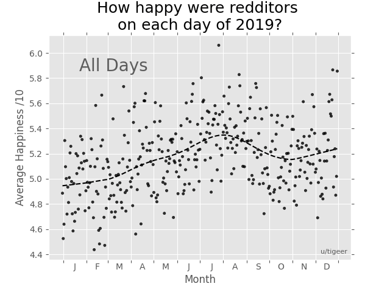

Python scripts for parsing and visualising mood diaries submitted to [r/dataisbeautiful](https://www.reddit.com/r/dataisbeautiful) by 73 different users. An average was taken for each day, which forms the plot you can see below
